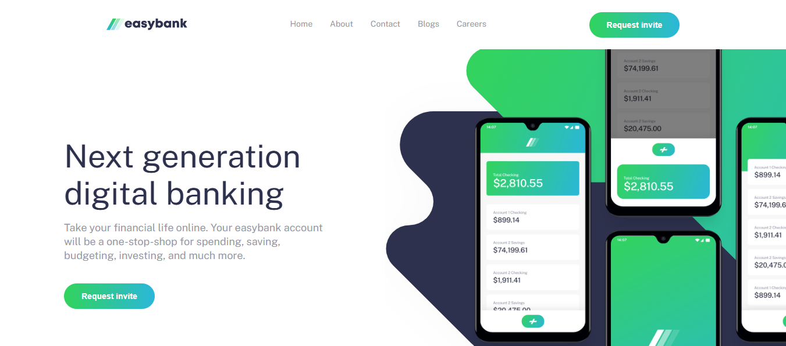

# Frontend Mentor - Easybank landing page solution

Ini adalah solusi untuk tantangan [Easybank landing page di Frontend Mentor](https://www.frontendmentor.io/challenges/easybank-landing-page-WaUhkoDN). Tantangan ini membantu meningkatkan skill frontend dengan membangun project nyata.

## Daftar Isi

- [Overview](#overview)
  - [Tantangan](#tantangan)
  - [Screenshot](#screenshot)
  - [Link](#link)
- [Proses Saya](#proses-saya)
  - [Dibangun dengan](#dibangun-dengan)
  - [Apa yang Saya Pelajari](#apa-yang-saya-pelajari)
  - [Pengembangan Lanjutan](#pengembangan-lanjutan)
  - [Sumber Bermanfaat](#sumber-bermanfaat)
- [Author](#author)
- [Acknowledgments](#acknowledgments)

## Overview

### Tantangan

Pengguna dapat:

- Melihat layout optimal di berbagai ukuran layar (responsive)
- Melihat efek hover pada semua elemen interaktif
- Mengakses menu mobile (hamburger menu)
- Menggunakan tombol scroll to top

### Screenshot



> Ganti gambar di atas dengan screenshot hasil project kamu.

### Link

- Solution URL: [Repo ini](https://github.com/username/easybank-landing-page)
- Live Site URL: [Demo di Netlify/Vercel/atau lokal](http://localhost:5500/) _(atau link deploy kamu)_

## Proses Saya

### Dibangun dengan

- HTML5 Semantik
- CSS Custom Properties (variabel)
- Flexbox & CSS Grid
- Mobile-first workflow
- Vanilla JavaScript (tanpa framework)

### Apa yang Saya Pelajari

- Cara membangun layout responsive dari mobile ke desktop
- Mengimplementasikan menu hamburger dengan aksesibilitas (keyboard support)
- Membuat tombol scroll to top dengan Intersection Observer
- Mengatur path gambar dan asset agar tidak error 404
- Menggunakan custom property CSS untuk konsistensi warna dan font

Contoh kode Intersection Observer:

```js
const scrollToTop = new IntersectionObserver((entries) => {
  entries.forEach((entry) => {
    const scrollToTopButton = document.querySelector(".scroll-to-top")
    if (entry.isIntersecting) {
      if (scrollToTopButton) {
        scrollToTopButton.removeEventListener(
          "click",
          scrollToTopButton.handleClick
        )
        scrollToTopButton.remove()
      }
    } else {
      if (!scrollToTopButton) {
        const button = createScrollToTopButton()
        document.querySelector("main").appendChild(button)
      }
    }
  })
})
```

### Pengembangan Lanjutan

- Menambah animasi pada menu dan tombol
- Menggunakan framework seperti React untuk latihan komponen
- Menambah dark mode

### Sumber Bermanfaat

- [Frontend Mentor Docs](https://www.frontendmentor.io/resources)
- [MDN Web Docs](https://developer.mozilla.org/)
- [CSS Tricks Responsive Design](https://css-tricks.com/snippets/css/media-queries-for-standard-devices/)

## Author

- Frontend Mentor - [@yourusername](https://www.frontendmentor.io/profile/yourusername)
- Twitter - [@yourusername](https://www.twitter.com/yourusername)

## Acknowledgments

Terima kasih untuk komunitas Frontend Mentor dan semua sumber inspirasi di internet!
