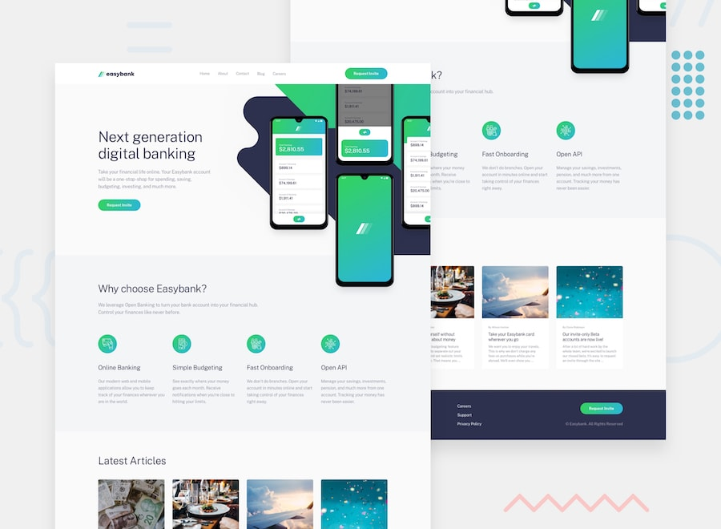

# Frontend Mentor - Easybank landing page (React + Vite)

Ini adalah solusi untuk tantangan [Easybank landing page di Frontend Mentor](https://www.frontendmentor.io/challenges/easybank-landing-page-WaUhkoDN). Tantangan ini membantu meningkatkan skill frontend dengan membangun landing page responsif dan modern.

## Table of contents

- [Overview](#overview)
  - [The challenge](#the-challenge)
  - [Screenshot](#screenshot)
  - [Links](#links)
- [My process](#my-process)
  - [Built with](#built-with)
  - [What I learned](#what-i-learned)
  - [Continued development](#continued-development)
  - [Useful resources](#useful-resources)
- [Author](#author)

## Overview

### The challenge

Pengguna dapat:

- Melihat layout optimal di berbagai ukuran layar (responsif)
- Melihat efek hover pada semua elemen interaktif

### Screenshot



### Links

- Solution URL: [Click Me...](https://github.com/wahyuanandaa/easybank-landing-page)
- Live Site URL: [Click Me...](https://wahyuanandaa.github.io/easybank-landing-page/)

## Struktur Gambar

- Semua gambar yang diimport di React (``) berada di `src/assets`.
- Semua gambar yang diakses dari CSS/background berada di `public/images`.
- Gambar yang dipakai di kedua tempat (misal: icon hamburger) harus ada di kedua folder.

## My process

### Built with

- React + Vite
- CSS Module per komponen (`.module.css` di folder `src/components`)
- Semantic HTML5 markup
- CSS custom properties (dari template asli)
- Flexbox
- Mobile-first workflow
- Google Fonts (Public Sans)

### What I learned

- Cara mengkonversi project HTML/CSS/JS statis menjadi project React modular
- Cara mengelola aset gambar dan SVG di React dan public
- Cara mengimpor style global dan modular (CSS Module) di React
- Cara menjaga struktur dan style tetap identik dengan desain asli

### Continued development

- Refactor utility class global ke CSS Module jika ingin isolasi penuh
- Menambah animasi interaktif pada menu mobile
- Menambah test unit untuk komponen utama

### Useful resources

- [Frontend Mentor](https://www.frontendmentor.io/challenges/easybank-landing-page-WaUhkoDN) - Sumber tantangan dan desain
- [Vite Documentation](https://vitejs.dev/guide/) - Untuk setup React modern
- [React Docs](https://reactjs.org/docs/getting-started.html)

## Author

- Frontend Mentor - [@wahyuanandaa](https://www.frontendmentor.io/profile/wahyuanandaa)

---

## Cara Menjalankan Project

1. Clone repository ini
2. Install dependencies:
   ```bash
   pnpm install # atau npm install
   ```
3. Jalankan development server:
   ```bash
   pnpm dev # atau npm run dev
   ```
4. Untuk build production:
   ```bash
   pnpm build # atau npm run build
   ```
5. Untuk preview hasil build:
   ```bash
   pnpm preview # atau npm run preview
   ```

## Deploy

- Anda bisa deploy ke Vercel, Netlify, atau GitHub Pages (lihat dokumentasi Vite untuk detail deploy)
